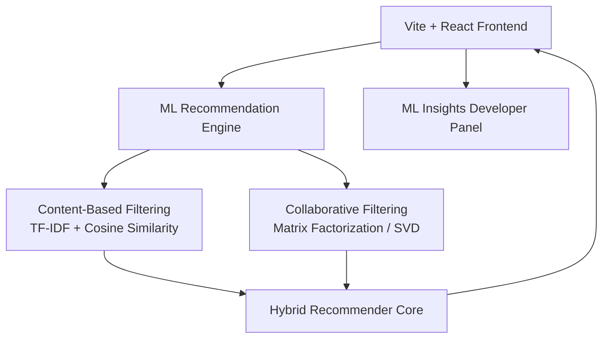

# FlixMind

https://flixmind.onrender.com/

FlixMind is a cinematic Netflix-style movie streaming dashboard with a real-time, client-side machine learning recommendation engine. It combines natural language processing, collaborative filtering, and an interactive explainability dashboard that visualizes how recommendations are computed.

---

## Features

1. **Cinematic Movie Portal**: A responsive interface with horizontal carousels, detailed pop-up modals, and a dynamic hero banner showcasing matching titles.
2. **Hybrid Recommendation Engine**:
   - **Content-Based Filtering**: Tokenizes movie synopses, filters stop words, and calculates a TF-IDF matrix over the corpus vocabulary.
   - **Cosine Similarity**: Computes keyword alignment and Jaccard categorical intersections for genres, cast members, and directors.
   - **Collaborative Filtering (SVD)**: Decomposes ratings into a 6-factor latent space and uses stochastic gradient descent to minimize prediction errors.
3. **ML Insights & Explainability Panel**:
   - **Taste Vectors**: Heatmaps illustrating user latent preferences across narrative dimensions.
   - **SGD Live Optimizer**: Animates model training across epochs and displays RMSE decay in real time.
   - **Similarity Matrix Correlation**: Interactive cosine similarity matrix with overlay tooltips.
   - **2D Latent Vector Scatter Plot**: Projects items onto principal latent dimensions to visualize clustering.
   - **Interactive NLP Scan**: Visualizes top-weighted TF-IDF terms for any selected movie.

---

## Architecture



### Collaborative Filtering

The collaborative algorithm projects users and items onto a shared latent feature space:

$$\hat{R}_{u, i} = \mu + b_u + b_i + P_u \cdot Q_i$$

Where:

- $\mu$ is the global average rating.
- $b_u$ and $b_i$ are the user and item biases.
- $P_u$ and $Q_i$ are the user and item latent feature vectors.

Parameters are optimized in the browser using stochastic gradient descent:

$$e_{u, i} = R_{u, i} - \hat{R}_{u, i}$$

$$P_{uf} \leftarrow P_{uf} + \gamma (e_{u, i} Q_{if} - \lambda P_{uf})$$

$$Q_{if} \leftarrow Q_{if} + \gamma (e_{u, i} P_{uf} - \lambda Q_{if})$$

---

## Local Setup

1. **Clone the repository**:

   ```bash
   git clone <repository>
   cd flixmind
   ```

2. **Install dependencies**:

   ```bash
   npm install
   ```

3. **Run the development server**:

   ```bash
   npm run dev
   ```

4. **Build for production**:

   ```bash
   npm run build
   ```

The production-ready assets are generated in the `dist` folder.

---

## UI Design System

Built with custom CSS in `src/index.css`, including:

- Curated HSL color spaces with a dark cinematic base and glowing indicators.
- Glass-style overlay components using visual blur filters.
- Fluid responsive carousels and details panel grids.
- Hover scale indicators for cinematic movie card selection.
