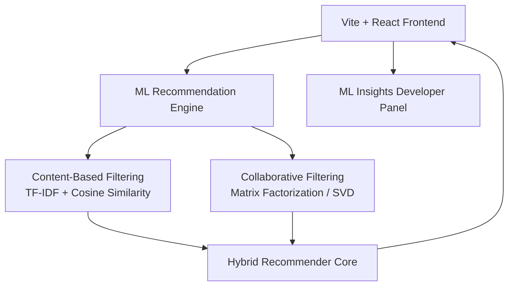

# FlixMind 🎬

https://flixmind.onrender.com/

**FlixMind** is a premium, cinematic Netflix-style movie streaming dashboard integrated with a fully functional, real-time client-side Machine Learning recommendation engine. It showcases advanced natural language processing (NLP) and collaborative filtering algorithms, combined with an interactive explainability dashboard that visualizes how recommendations are computed.

---

## 🚀 Live Demo & Deployment

- **Live URL**: See the link at the top of this README *(deployed via Render Static Sites)*.
- **Deployment**: The project is configured for Render Static Sites.

---

## ✨ Features

1. **Cinematic Movie Portal**: A premium, responsive interface featuring horizontal carousels, detailed pop-up modals, and a dynamic hero banner showcasing matching titles.
2. **Hybrid Recommendation Engine**:
   - **Content-Based Filtering**: Written in pure JavaScript, it tokenizes movie synopses, filters out 60+ stop-words, and calculates a **TF-IDF matrix** over the corpus vocabulary.
   - **Cosine Similarity**: Computes keyword alignment and Jaccard categorical intersections for genres, cast members, and directors.
   - **Collaborative Filtering (SVD)**: Decomposes ratings into a 6-factor latent space. Utilizes **Stochastic Gradient Descent (SGD)** to minimize prediction bias and squared errors.
3. **ML Insights & Explainability Panel**:
   - **Taste Vectors**: Heatmaps illustrating user latent preferences across narrative dimensions.
   - **SGD Live Optimizer**: Animate the model's training process over multiple epochs and observe the RMSE (Root Mean Square Error) decay curve in real-time.
   - **Similarity Matrix Correlation**: Interactive 10x10 cosine similarity matrix with overlay tooltips.
   - **2D Latent Vector Scatter Plot**: Projects items onto the principal latent dimensions to visualize spatial item clustering.
   - **Interactive NLP Scan**: Visualizes top-weighted TF-IDF terms for any selected movie.

---

## 🛠️ Architecture & ML Implementation



### Collaborative Filtering: Singular Value Decomposition (SVD)
The collaborative algorithm projects users and items onto a shared latent feature space:
$$\hat{R}_{u, i} = \mu + b_u + b_i + P_u \cdot Q_i$$
Where:
- $\mu$ is the global average rating.
- $b_u$ and $b_i$ are the user and item biases.
- $P_u$ and $Q_i$ are the user and item latent feature vectors.

Parameters are optimized in the browser using **Stochastic Gradient Descent (SGD)**:
$$e_{u, i} = R_{u, i} - \hat{R}_{u, i}$$
$$P_{uf} \leftarrow P_{uf} + \gamma (e_{u, i} Q_{if} - \lambda P_{uf})$$
$$Q_{if} \leftarrow Q_{if} + \gamma (e_{u, i} P_{uf} - \lambda Q_{if})$$

---

## 📦 Local Setup & Installation

Follow these steps to run the application locally on your machine:

1. **Clone the Repository**:
   ```bash
   git clone <repository>
   cd flixmind
   ```

2. **Install Dependencies**:
   ```bash
   npm install
   ```

3. **Run the Development Server**:
   ```bash
   npm run dev
   ```
   *The application will launch locally on the Vite development server.*

4. **Build for Production**:
   ```bash
   npm run build
   ```
   *Compiles the production-ready assets into the `dist/` folder.*

---

## 🎨 UI Design System
Built using custom **Vanilla CSS** (located in `src/index.css`) containing:
- Vibrant, curated **HSL color spaces** (sleek dark mode base with primary glowing indicators).
- **Glassmorphic** overlay components using visual blur filters.
- Fluid, responsive carousels and details panel grids.
- Hover scale-zoom indicators for cinematic movie card selection.
